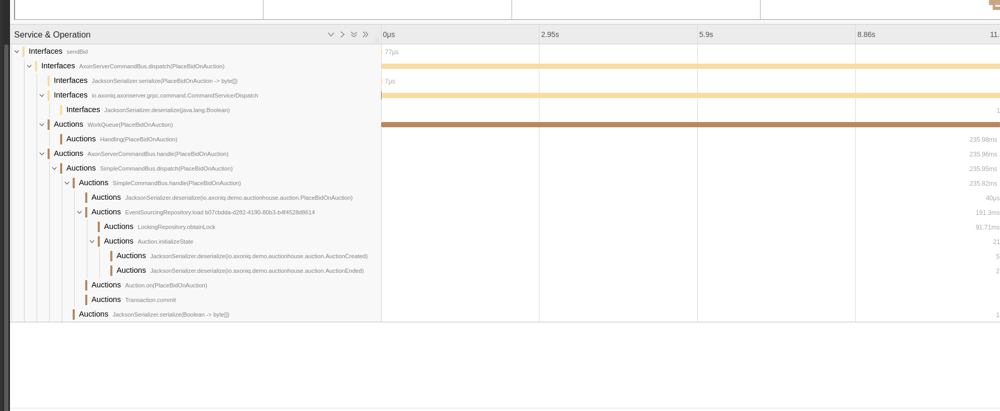

# Axon Framework Microscope Extension

[Axon Framework](https://developer.axoniq.io/axon-framework/overview) is one of the best CQRS/ES frameworks in the
market today.
However, sometimes you want to put your application under a microscope and dig very deep into why it acts a little slow.
If so, this is the extension for you!

> **Warning**: This extension is not meant to be used in production. Although it can be used, it might have an impact on
> the performance.
> It is mainly meant to be used in test environments in order to find bottlenecks in your perfomance.

## Requirements

- Micrometer
- Spring Boot 2 or 3

## Installation

You only need to add this starter to your Spring Boot project:

```xml

<dependency>
  <groupId>com.insidion.axon.microscope</groupId>
  <artifactId>axon-microscope-starter</artifactId>
  <version>0.0.1</version>
</dependency>
```

The extension is disabled by default. Add the following property to enable it:
```properties
com.insidion.axon.microscope
```

Non-Spring projects are not supported, for now. If you want I can add that, please create an issue.
Both Spring Boot 2 and 3 are supported.

## Features

The library adds additional metrics and traces to your Axon application. It will automatically detect your Axon
configuration and instrument the necessary beans.

## Reconfiguration of metrics

Some reconfigurations have been made to the MetricsConfigurer module of Axon Framework:

- All metrics are now only valid for 1 minute, instead of 10. This provides more reactive metrics.
- Event processors no longer have a latency per payload type, instead only per processor

### Additional tracing

The following additional traces have been added:

- Traces have been added for the `AxonServerQueryBus` and `AxonServerCommandBus` to trace the duration it was scheduled
  in the work queue.
- All `Serializer.serialize` and `Serializer.deserialize` invocations have had traces added
- All Grpc methods for the AxonServer connector have had traces added

You can see the effect in the following picture, where we can see the command being stuck in the queue for a while. Note
that the Serializer invocations are very fast, and we can rule them out as bottleneck.


### Additional metrics

A lot of additional metrics have been added. These include:

- Ingest and commit latencies for event processors
  - `$componentName.latency.ingest` Ingest latency is the time between publish and arrival at event handler
  - `$componentName.latency.commit` Commit latency is the time between publish and commit finished in the database
- Segment claimed percentage exposed
  - `commandBus.capacity.total`
  - `queryBus.capacity.total`
  - Use this to make a relative metric (`commandBus.capacity / commandBus.capacity.total`)
- Serializer metrics
  - `$serializerName.serialize`
  - `$serializerName.deserialize`
- Queueing metrics
  - `axonServerCommandBus.ingest.queueTime` - Time command spent in the queue before being processed
  - `axonServerCommandBus.ingest.latency` - Time command took from dispatch to arrival in executor
  - `axonServerQueryBus.ingest.queueTime` - Time query spent in the queue before being processed
  - `axonServerQueryBus.ingest.latency` - Time query took from dispatch to arrival in executor
- Token Store metrics
  - `TokenStoreClass.storeToken` - Time it took to store a token
  - `TokenStoreClass.fetchToken` - Time it took to fetch a token
  - `TokenStoreClass.extendClaim` - Time it took to extend claim on a token
- Aggregate metrics
  - `aggregateLockTime` - Time it took to acquire a lock an aggregate
  - `aggregateLoadTime` - Time it took to load an aggregate
  - `eventCommitTime` - Time it took to commit the events from command handling
  - `eventStore.readEvents` - Time it took to read events from the event store
  - `eventStore.aggregateStreamSize` - Time it took to read events from the event store
- Processor metrics
  - `eventProcessor.segments.claimed` - Percentage of claimed segments. Sum over all instances, should become 1
  - `eventProcessor.dlq.size` - Size of the DLQ
- Grpc Metrics
  - `grpc.duration` - Seconds it took to fully complete a grpc call

Replace `$componentName` with the name of the component, such as `eventProcessor` or `commandBus`
